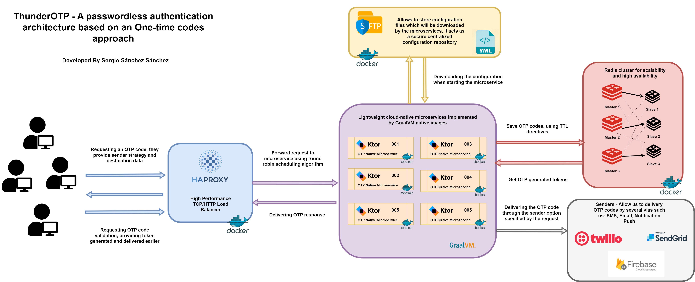
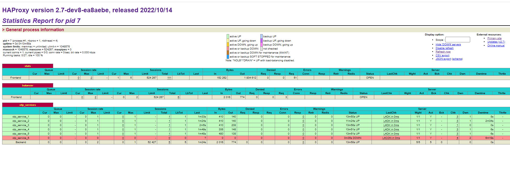
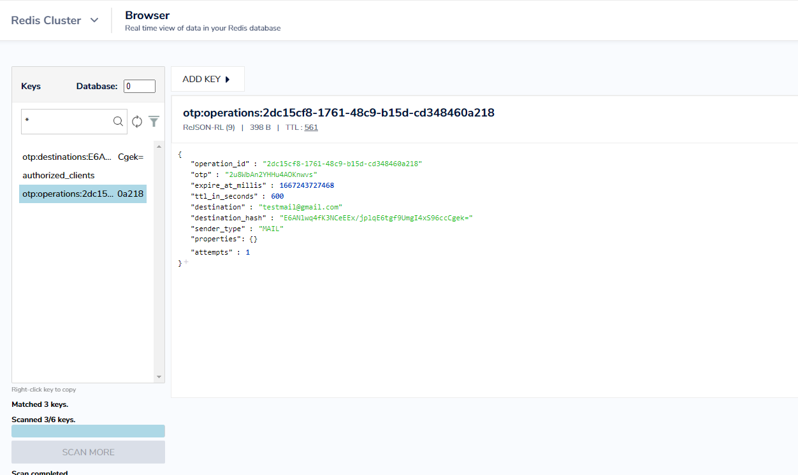

# ThunderOTP - A passwordless authentication architecture based on One-time codes approach.

Passwordless authentication will be the future of online authentication!

Passwordless authentication has been gaining traction, and the main reason is the lack of security that passwords offer today, as passwords are reused and stolen, more and more frequently. The second reason is that passwords have to be increasingly complex, which degrades the user experience. Security and user experience are among the top priorities of any digital company and usually are in direct conflict. Hence the interest in passwordless authentication, with its promises to offer more security and a better user experience at the same time.

## What is passwordless authentication?

In online authentication, a passwordless authentication system is any process that authenticates the user without using a password, more specifically is the verification of a user's identity by a method that does not require a password. It is important to make a clear distinction between the different methods used to deliver passwordless authentication. Some are more secure and some provide a better user experience. This architecture has been implemented using the one-time passwords (OTPs) solution. They are best known for multi-factor authentication processes, but one-time passwords or one-time codes can also be used as a standalone authentication method.

## How do OTPs work in passwordless authentication?

One-time passwords (or OTPs) are numeric codes linked to a reference. These codes are sent to the user, so only the server and the user can know this code. When the user enters the code in the platform, they are granted with access and hence they are authenticated.

These codes will be sent to the user's phone via SMS, Push Notification or e-mail.

Furthermore, one-time passwords are always linked to a unique reference, so there aren't any chances that the code is overtaken by different uses. OTPs can be limited in time too, which limits the time of validity of the code.

## Architecture Overview

## Powered by lightweight cloud-native microservices implemented by Ktor Graalvm native images.

Using GraalVM Native Image technology we can compile the services to native code ahead of time in a way in which the resulting binary does not depend on the JVM for the execution. This executable can be placed as a standalone application in a container and started really, really fast.

  

* Faster startup time: Building Ahead-of-time compiled microservices that start in milliseconds and deliver peak performance with no warmup.
* Low resource usage: Building Ahead-of-time compiled microservices that use only a fraction of the resources required by the JVM which means they cost less to run and improve utilization.
* Small container image: Trying to compact native executables in lightweight container images for more secure, faster, and efficient deployments.
* Minimize vulnerability: Trying to reduce the attack surface area using Native image by removing all unused classes, method, and fields from your application and libraries while making reverse engineering difficult by converting Java bytecode into native machine code.

  

## Used technology.

* Redis Cluster Architecture ( rejson module enabled).
* HAProxy Load Balancer.
* Ktor Framework.
* Netty Server.
* Graalvm high-performance JDK distribution.
* Twilio Java Helper Library.
* Sendgrid Java Helper Library.
* Firebase Cloud Messaging.
* Jedis ( A redis Java client designed for performance and ease of use ).
* Hoplite ( A boilerplate-free Kotlin config library for loading configuration files as data classes ).

## Running Applications as Docker containers.

### Rake Tasks

The available tasks are detailed below (rake --task)

| Task | Description |
| ------ | ------ |
| thunderotp:check_docker_task | Check Docker and Docker Compose Task |
| thunderotp:cleaning_environment_task | Cleaning Evironment Task |
| thunderotp:deploy | Deploys Platform Containers and launches all services and daemons needed to properly work |
| thunderotp:login | Authenticating with existing credentials |
| thunderotp:platform:build_hotspot_image | Build Docker Image based on Hotspot JVM |
| thunderotp:platform:build_native_image | Build Docker Image based on Graavlm |
| thunderotp:platform:check_deployment_file | Check Platform Deployment File |
| thunderotp:platform:start | Start Platform Graalvm Containers |
| thunderotp:platform:start_hotspot | Start Platform Hotspot JVM Containers |
| thunderotp:platform:stop | Stop Platform Graalvm Containers |
| thunderotp:platform:stop_hotspot | Stop Platform Hotspot JVM Containers |
| thunderotp:redis:check_deployment_file | Check Redis Cluster Deployment File |
| thunderotp:redis:start | Start and configure Cluster Containers |
| thunderotp:redis:stop | Stop Cluster Containers |
| thunderotp:status | Status Containers |
| thunderotp:undeploy | Undeploy Platform Containers |

To start the platform make sure you have Ruby installed, go to the root directory of the project and run the `rake deploy` task, this task will carry out a series of preliminary checks, discard images and volumes that are no longer necessary and also proceed to download all the images and the initialization of the containers.

### Containers Ports

In this table you can view the ports assigned to each service to access to the Web tools or something else you can use to monitoring the flow.

| Container | Port |
| ------ | ------ |
| Redis Insight | localhost:8001 |
| HAProxy Load Balancer | localhost:9090 |
| HAProxy Stats | localhost:8404 |

## Some screenshots

As follow, I include some images that help us to understand the performance of each part of system

